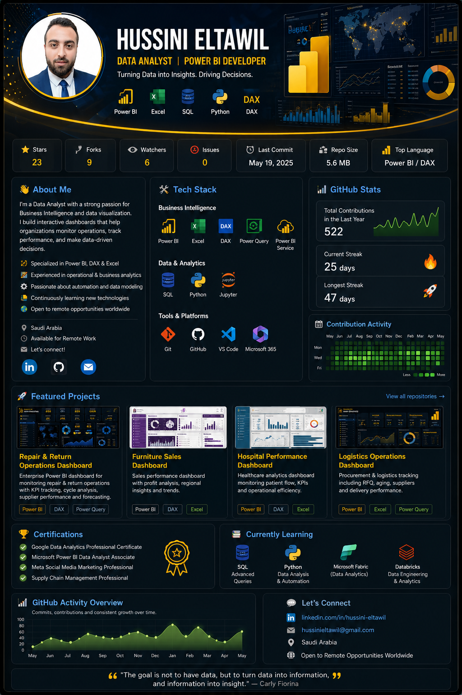

  

<h1 align="center">Hi 👋, I'm Hussieni Gamal</h1>

<h3 align="center">
Data Analyst | Power BI Developer | Python | SQL | Excel
</h3>

Turning Raw Data into Actionable Business Insights

---

## 👨‍💻 About Me

I'm a **Data Analyst** with a background in pharmacy operations and business analysis.

I enjoy transforming raw data into meaningful insights and interactive dashboards using **Python, SQL, Power BI, and Excel**.

My focus is solving real business problems through data analysis, visualization, and decision support.

Currently expanding my portfolio with real-world analytics projects.

---

# 🚀 Tech Stack

### Analytics Tools

- Power BI
- DAX
- Power Query
- Excel
- Pandas
- NumPy
- Matplotlib

---

# ⭐ Featured Projects

## 💊 Pharmacy Sales Analysis (Python)

EDA project analyzing six years of pharmacy sales data using Python.

### Highlights

- Data Cleaning
- Data Wrangling
- Feature Engineering
- Exploratory Data Analysis (EDA)
- Sales Trend Analysis
- Monthly Seasonality
- Hourly Sales Analysis
- Drug Category Analysis
- Correlation Analysis
- Business Insights

**Tools**

Python • Pandas • NumPy • Matplotlib • Jupyter Notebook

🔗 Repository

https://github.com/HussieniGamal/Pharmacy-Sales-Analysis-Python

---

## 🔧 Repair & Return Operations Dashboard

Interactive Power BI dashboard for monitoring repair operations, bottlenecks, turnaround time, and operational KPIs.

### Highlights

- KPI Dashboard
- Cycle Time Analysis
- Bottleneck Analysis
- Interactive Filters
- DAX Measures
- Power Query

**Tools**

Power BI • DAX • Power Query • Excel

🔗 Repository

https://github.com/HussieniGamal/PowerBi-Repair-Return-Operations-Dashboard

---

## 🏥 HMC Hospital Dashboard

Healthcare analytics dashboard built with Power BI.

### Highlights

- Hospital Performance
- Patient Analysis
- Department KPIs
- Medical Dashboard

🔗 Repository

https://github.com/HussieniGamal/HMC-Hospital-Dashboard

---

## 🛋 Furniture Sales Dashboard

Business Intelligence dashboard for furniture sales performance.

### Highlights

- Sales Performance
- Regional Analysis
- Product Analysis
- Executive Dashboard

🔗 Repository

https://github.com/HussieniGamal/Furniture-Sales-Dashboard

---

## 🛒 Younes Store Sales Dashboard

Retail sales dashboard focusing on sales performance and business insights.

### Highlights

- Sales KPIs
- Product Performance
- Customer Insights
- Power BI Reporting

🔗 Repository

https://github.com/HussieniGamal/Younes-Store-Sales-Dashboard

---

# 📊 GitHub Stats

---

# 📫 Connect With Me

- 💼 LinkedIn: www.linkedin.com/in/hussieni-gamal-549b68134

- 💻 GitHub: https://github.com/HussieniGamal

---

⭐ Thank you for visiting my profile!

